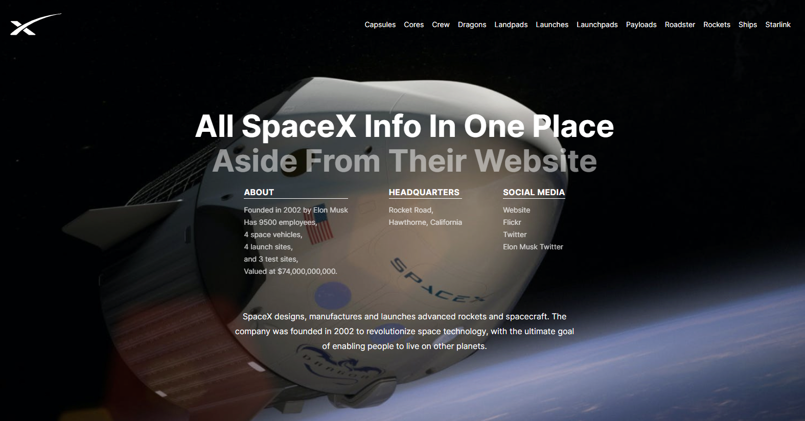

# SpaceX Informational Web App

Built in ReactJs, this web app contains all the information about SpaceX that is fetched continually from `https://api.spacexdata.com`.

## What information is contained within?

1. Company Information
2. Capsules
3. Cores
4. Crew
5. Dragons
6. Landpads
7. Launches
8. Launchpads
9. Payloads
10. Roadster
11. Rockets
12. Ships
13. Starlink

- So basically all the information from `https://api.spacexdata.com` (Hint: Use Postman to query the API - otherwise it does not work - at least for me it did not)
